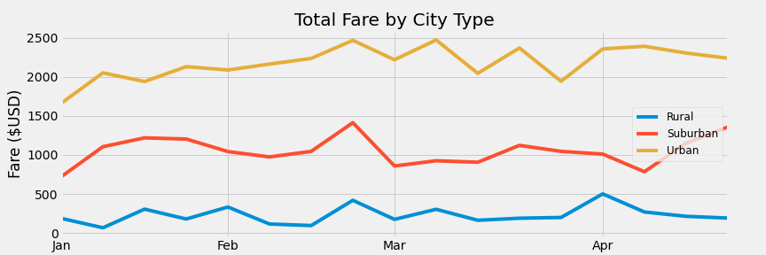

# PyBer_Analysis
## Overview
### Purpose for New Analysis
The purpose for this new analysis is to create a summary table and line chart to get an overall view of the ride sharing data by city type. The data will be used to provide business recommendations to the CEO for addressing disparities among the city types.
## Results
### Creating Visuals
We began by creating a summary table. Each row holds data for one city type. Three of the columns, Total Rides, Total Drivers, and Total Fares, are calculated by the total sums. Average Fare per Ride is the Total Fares divided by the Total Rides. Similarly, Average Fare per Driver is calcuted by dividing the Total Fares by the Total Drivers. The resulting table is as shown:

We next created a multi-line chart showing the total fare by city type for the first four months of 2019. 

### Analysis
At first glance, the summary table and chart appear to show expected results. It is reasonable to expect that the largest city type, Urban, would have the greatest number of drivers and rides and the highest total fares. However, taking a closer look at the details in the summary table raises some concerns.

- The number of drivers in rural cities seems disproportionately high. The ratio of rural drivers to urban drivers is 1 to 300. 
- The average fare per driver in rural cities is $55.49, about 3.5 times greater than the average fare per driver in urban cities.
- The number of total drivers in urban cities exceeds the number of total rides by 780, almost a full third of the total urban drivers.
- There is a $10 difference between the average fare per ride in rural and urban cities and $6 between suburban and urban cities. 

Our analysis reveals that there is a problem with the data for Urban cities, namely that the number of drivers is overstated. One possible reason for the high number of drivers is that the data includes inactive drivers. Assuming one ride per driver, that would bring the number of active drivers from 2,405 to 1,625. Since we know that drivers will probaby have more than one ride, we know the active number of drivers is fewer than 1,625. Removing inactive drivers from the data will raise the average fare per driver in urban cities.

In terms of the disparity between the city types in average fare per ride, there is not enough data to determine what is causing the large differences. The simplest explanation is that the cost of rides is highest in rural cities because they have the least number of drivers, while the cost is lowest in urban cities because they have the greatest number of drivers. However, that explanation does not take into account other variables that impact cost - how long the ride takes and the distance it covers, for instance. In order to understand if the average fares by city type are reasonable, we need to add distance and time to the data.
## Summary
### Recommendation 1
Create a policy that defines "inactive driver" and outlines how and when inactive drivers are separated from active drivers so they do not skew the data.
### Recommendation 2
Add miles per ride and time per ride to the data to allow for better understanding of fare per ride by city.
### Recommendation 3
Consider adding a component that equalizes the data across the city types, for instance, population per square mile. Some of the disparities of the current analysis could be that we are trying to compare apples to oranges to bananas. If we can find some commonalities that allow for fruit to fruit to fruit comparisons, we can have greater confidence that the disparities we see in the summary table are actual disparities and not just differences inherent in the nature of the city types.
